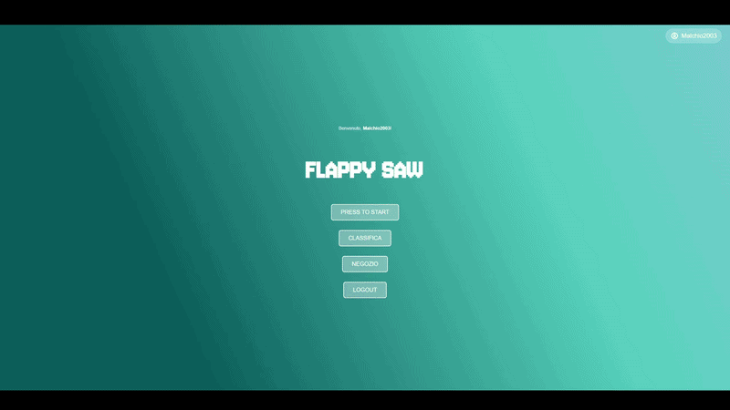
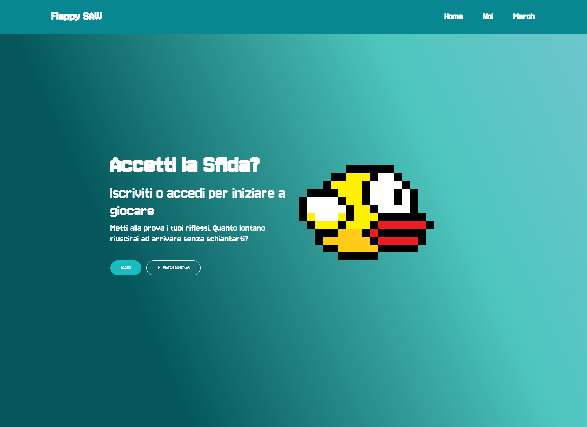
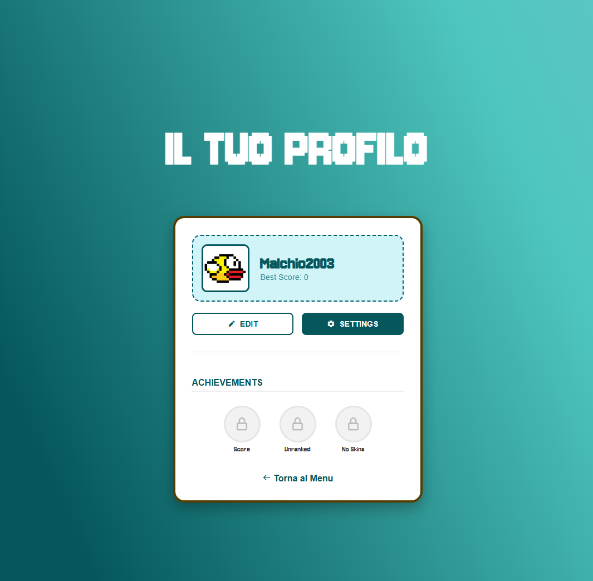
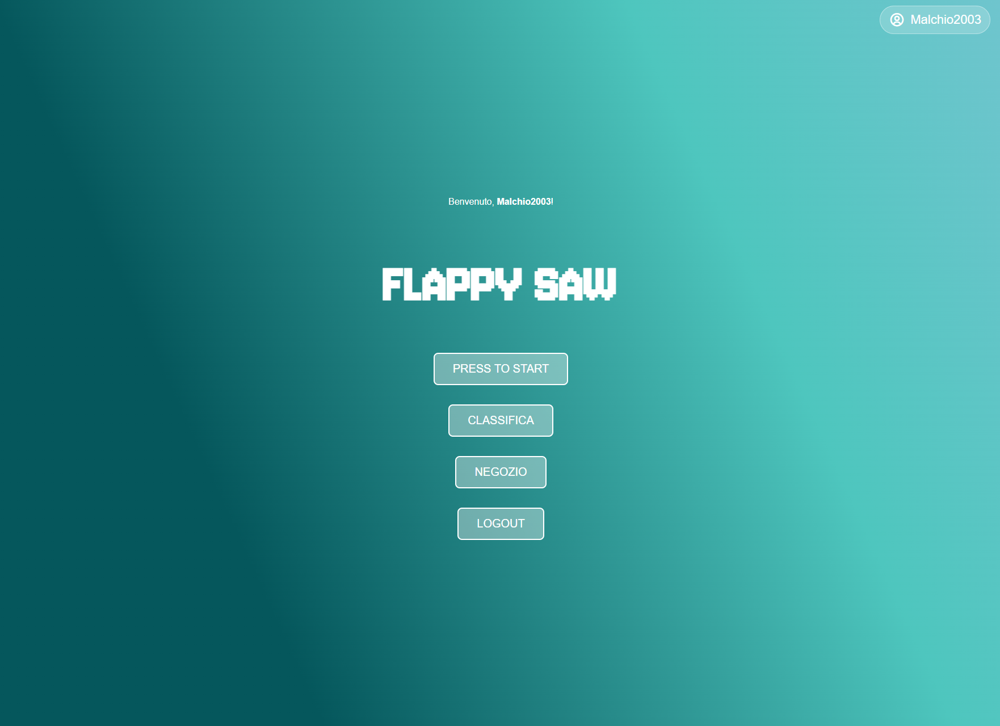
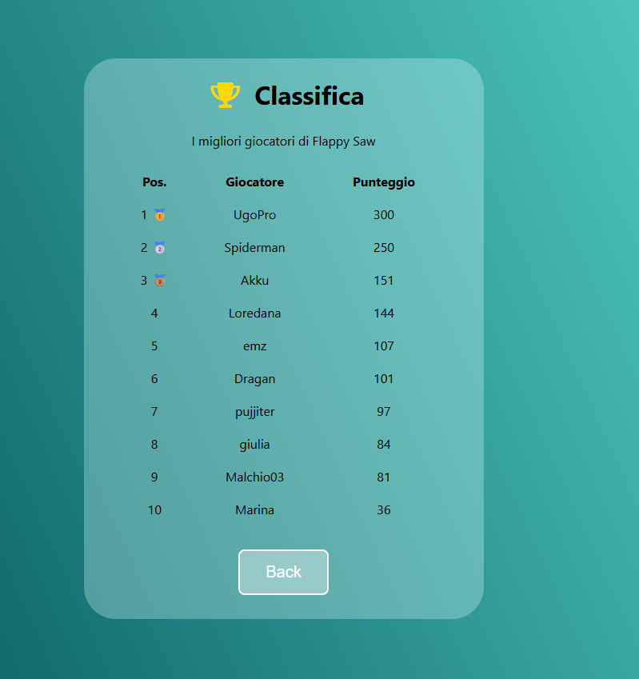
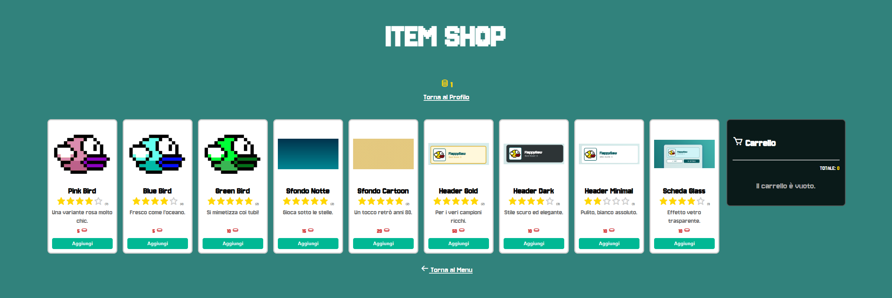

# Flappy Saw

**Flappy Saw** è un gioco arcade ispirato al classico *Flappy Bird*, sviluppato con uno stile grafico **pixel art**.

Il progetto non si limita alla semplice meccanica di gioco, ma include un sistema completo di **account, profili, classifiche, obiettivi e negozio**, permettendo al giocatore di personalizzare la propria esperienza e tenere traccia dei propri progressi.

---

## Gameplay

---

## Caratteristiche

- **Gameplay arcade** ispirato a Flappy Bird
- **Registrazione e accesso** degli utenti
- **Profilo personale** con informazioni e punteggio migliore
- **Classifica globale** dei giocatori
- **Sistema di obiettivi**
- **Moneta di gioco** ottenibile giocando
- **Negozio di oggetti**
- **Personalizzazione** dell'esperienza di gioco
- Personalizzazione della **scheda profilo**

---

## Screenshot

### Home Page

La pagina iniziale permette all'utente di accedere o registrarsi e presenta il gioco e le sue funzionalità principali.

---

### Profilo

Ogni giocatore dispone di un profilo personale dove può visualizzare il proprio username, il miglior punteggio, gli obiettivi ottenuti e le impostazioni del proprio account.

---

### Menu di gioco

Dal menu principale è possibile iniziare una partita, visualizzare la classifica, accedere al negozio oppure effettuare il logout.

---

### Classifica

La classifica mostra i migliori punteggi ottenuti dai giocatori, permettendo di confrontare le proprie prestazioni con quelle degli altri utenti.

---

### Negozio

Il negozio permette di utilizzare la moneta di gioco per acquistare diversi oggetti cosmetici e personalizzare il proprio profilo.

Sono disponibili diverse categorie di oggetti:

- **Foto profilo del personaggio**
- **Sfondi**
- **Header**
- **Schede profilo**

---

## Personalizzazione

Il giocatore può modificare diversi elementi della propria esperienza.

---

## Sistema di obiettivi

Flappy Saw include un sistema di achievement che permette di premiare i giocatori in base ai risultati raggiunti durante il gioco.

Gli obiettivi possono essere sbloccati ottenendo determinati punteggi o soddisfacendo specifiche condizioni.

---

## Struttura del progetto

Il progetto è organizzato in diversi componenti che gestiscono le principali funzionalità dell'applicazione:

- Autenticazione e gestione degli utenti
- Logica di gioco
- Gestione dei punteggi
- Classifica
- Achievement
- Sistema di valuta
- Negozio
- Personalizzazione del profilo
- Gestione delle impostazioni

---

## Obiettivo del progetto

L'obiettivo del progetto è stato quello di sviluppare un semplice gioco arcade trasformandolo in una piccola piattaforma con funzionalità tipiche dei videogiochi moderni.

Oltre alla realizzazione del gameplay, il progetto ha permesso di lavorare su aspetti come:

- gestione degli utenti;
- persistenza dei dati;
- classifiche;
- sistemi di progressione;
- personalizzazione;
- progettazione di interfacce grafiche;
- gestione dell'interazione tra le diverse componenti dell'applicazione.

---

## Autori

Sviluppato da **Riccardo Malchiodi** e **Giulia Ponassi** come progetto universitario per il corso **Sviluppo di Applicazioni Web**.
